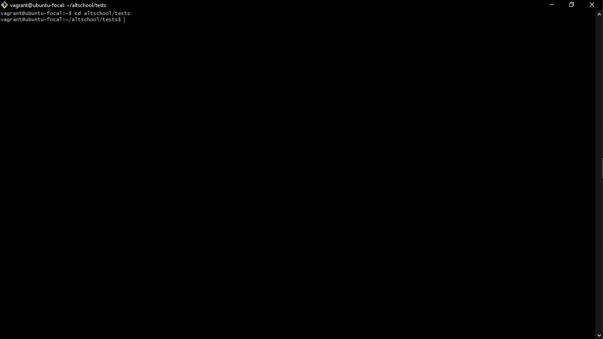
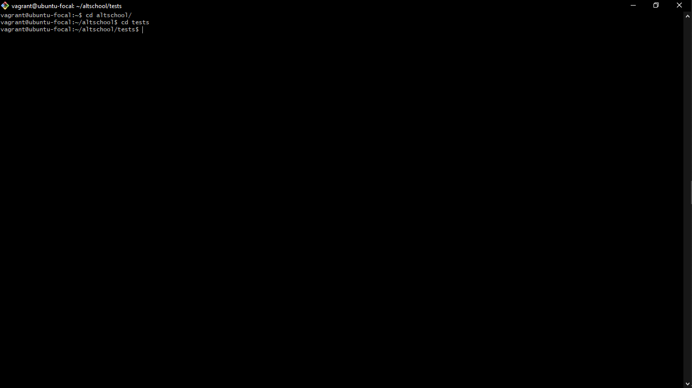
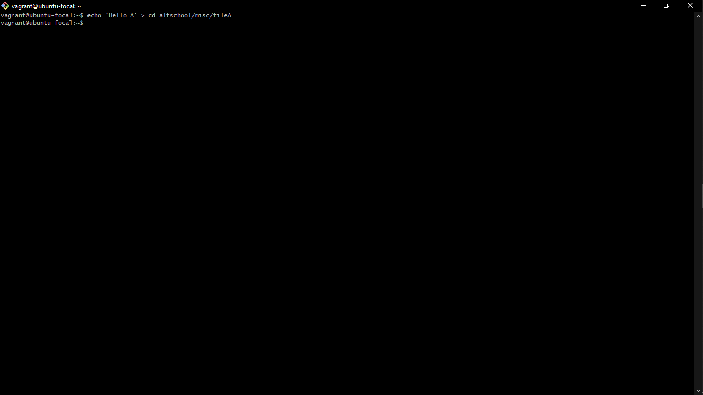
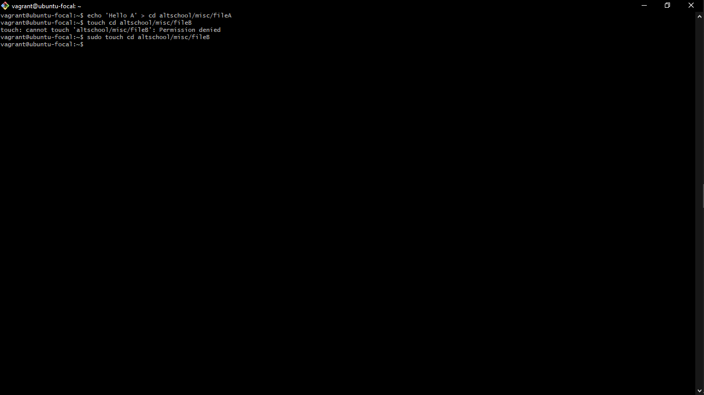
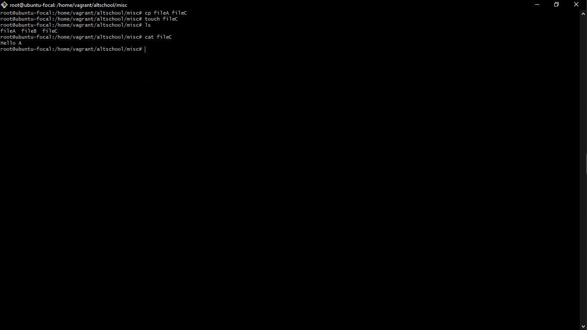
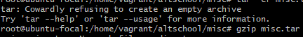
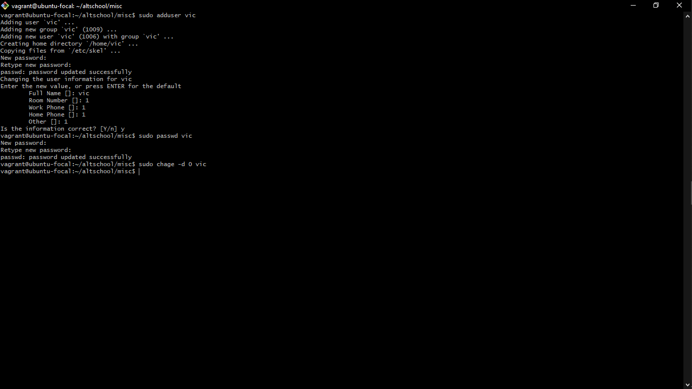
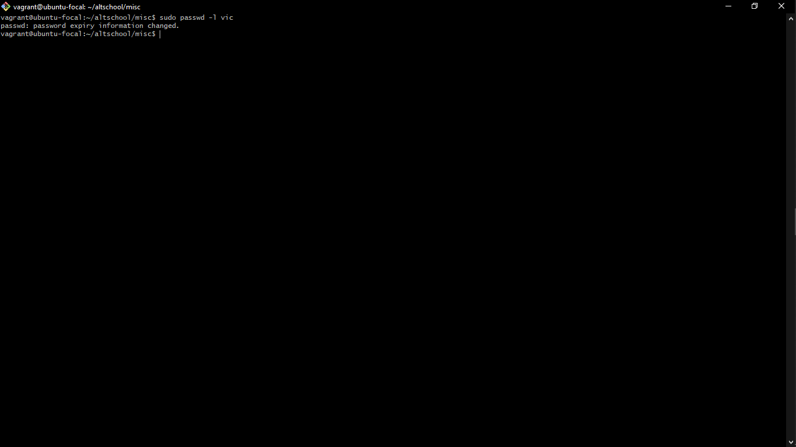
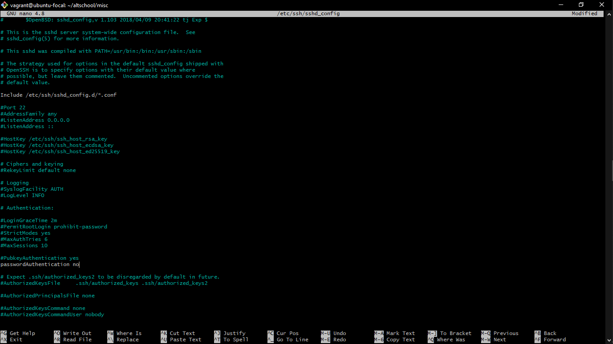
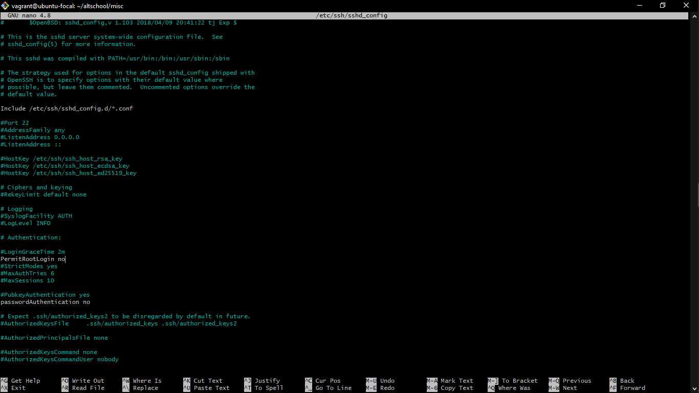

# Linux-sys-files-and-permissions
Your login name: altschool i.e., home directory /home/altschool. The home directory contains the following sub-directories: code, tests, personal, misc Unless otherwise specified, you are running commands from the home directory.

 

A. Change directory to the tests directory using absolute pathname
 

B. Change directory to the tests directory using relative pathname
 

C. Use echo command to create a file named fileA with text content ‘Hello A’ in the misc directory
 

D. Create an empty file named fileB in the misc directory
 

E. Copy contents of fileA into fileC
 

F. Move contents of fileB into fileD g.Create a tar archive called misc.tar for the contents of misc directory h.Compress the tar archive to create a misc.tar.gz file
 

G. Create a user and force the user to change his/her password upon login
 

H. Lock a users password
 

I. Create a user with no login shell
 

J. Disable password based authentication for ssh
 

K. Disable root login

# SOLUTION TO THE TASK.
A . `Change directory to the tests directory using absolute pathname`
     

B . `Change directory to the tests directory using relative pathname`
    

C . `Use echo command to create a file named fileA with text content ‘Hello A’ in the misc directory`
    

D . `Create an empty file named fileB in the misc directory`
    

E . `Copy contents of fileA into fileC`
    

F-i. `Move contents of fileB into fileD `
    

 ii. `Create a tar archive called misc.tar for the contents of misc directory`  
    

iii. `Compress the tar archive to create a misc.tar.gz file`   
    

G . `Create a user and force the user to change his/her password upon login`
    

H . `Lock a users password`
    

I . `Create a user with no login shell`
    

J . `Disable password based authentication for ssh` 
    

K . `Disable root login`
           